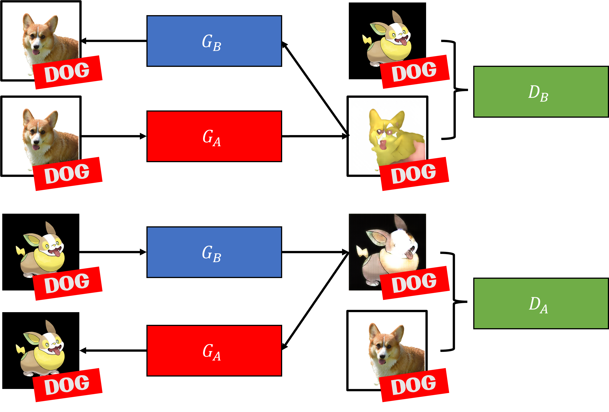
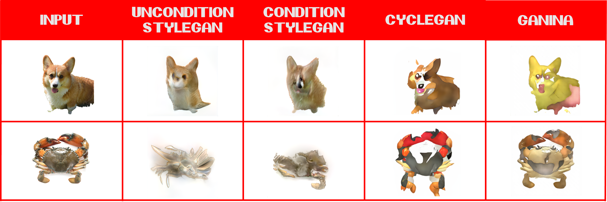

# GAN In Animal

## SUTD DAI 60.001 Applied Deep Learning project

Refer to the original repo for the original implementation [here](https://github.com/HASSRaccoon/ADL-Pokify-GAN), this repo will be used to deploy the model.

The proposed Generative Adversarial Networks (GAN) is a conditional Generative Adversarial Networks (cGAN) based on CycleGAN. The main difference is that we will be passing the labels such that the discriminator can compare the generated pokemon with a real pokemon that belongs to the same type of animal.

We have also used StyleGAN2 as a baseline to compare with the GAN that we proposed (Baseline model will be removed from this repo). The following image is the results of the generated images.

## Getting Started

### Links to download pretrained-model and datasets

Link to dataset: [HERE](https://drive.google.com/file/d/1QHY-0eYQYZe_u9keyIkSYFyldKgUBEiL/view?usp=share_link)

Link to models: [HERE](https://drive.google.com/file/d/1Dry20HKoD7-oiXlKVs-dkKg1AcYKPk4T/view?usp=share_link)

### Preparing Dataset

For cGAN, `dataset.json` is required, but need to delete the file if using the normal GAN.

Move the dataset to folders:

Unzip `dataset_cyclegan.zip`. Move`trainA` and `trainB` to `./cyclegan/train_datasets`. To test images, create another folder call `testA`.

### Preparing Pre-trained Models

Move the model to folders:

`animal2pkmn_cond`, `animal2pkmn_new` and `animal2pkmn_xavier` to `./cyclegan/checkpoints`.

### Using the Models

Refer to Jupyter Notebook `CycleGAN.ipynb`.

## References

Zhu, J.-Y., Park, T., Isola, P., & Efros, A. A. (2017). Unpaired Image-to-Image Translation using Cycle-Consistent Adversarial Networks. Computer Vision (ICCV), 2017 IEEE International Conference On. Available at: https://github.com/junyanz/pytorch-CycleGAN-and-pix2pix

PokeAPI, The RESTful Pokémon API. Available at: https://github.com/PokeAPI/pokeapi
